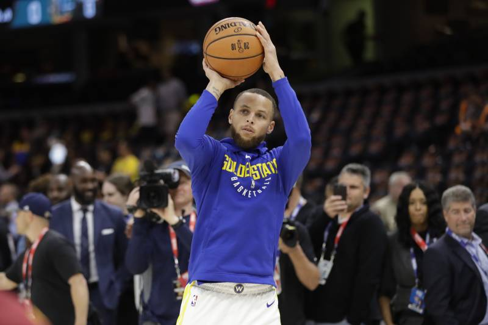
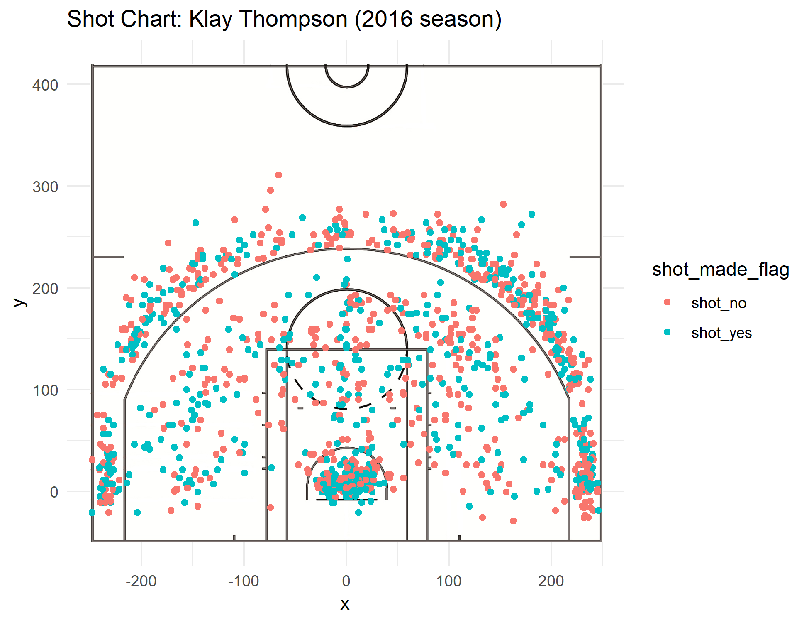
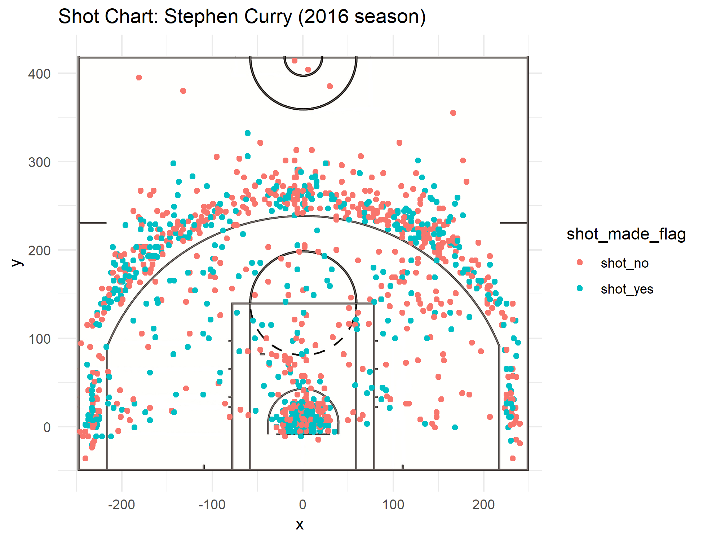
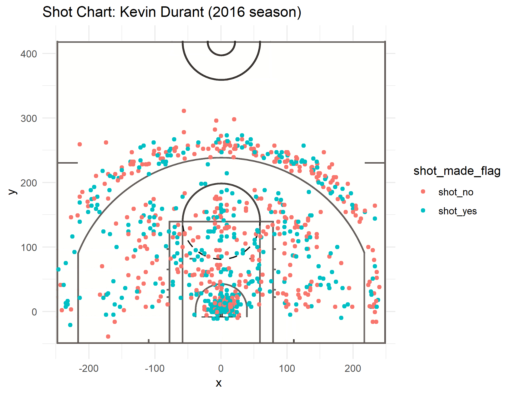
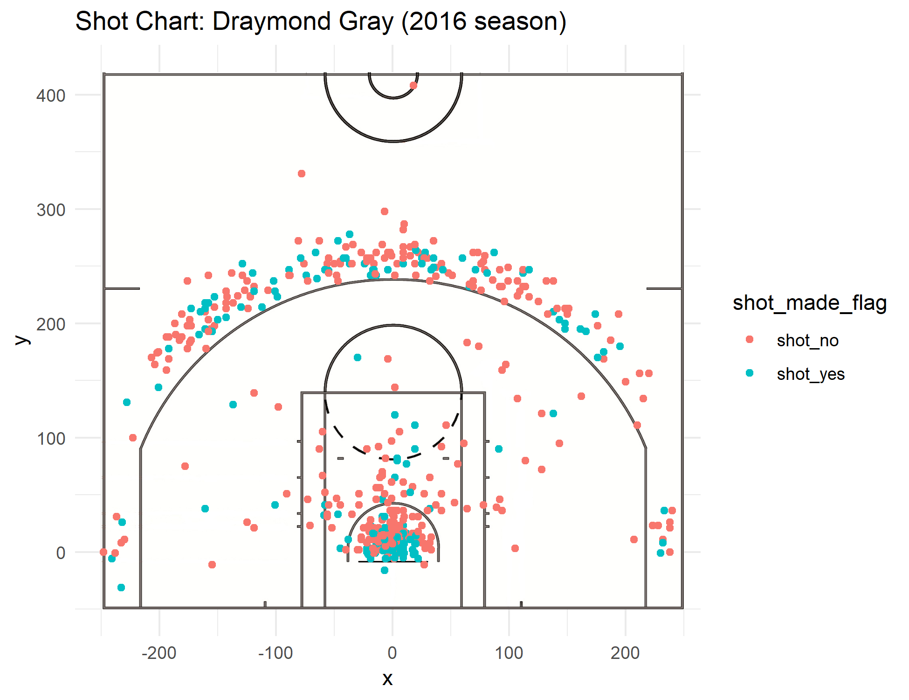
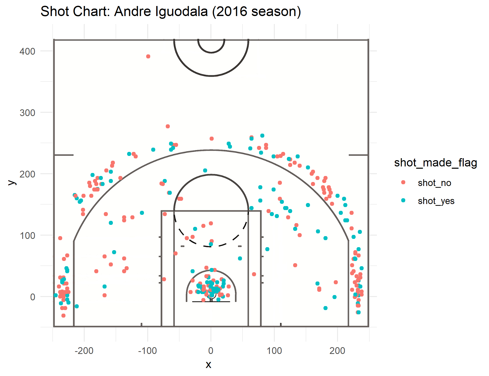
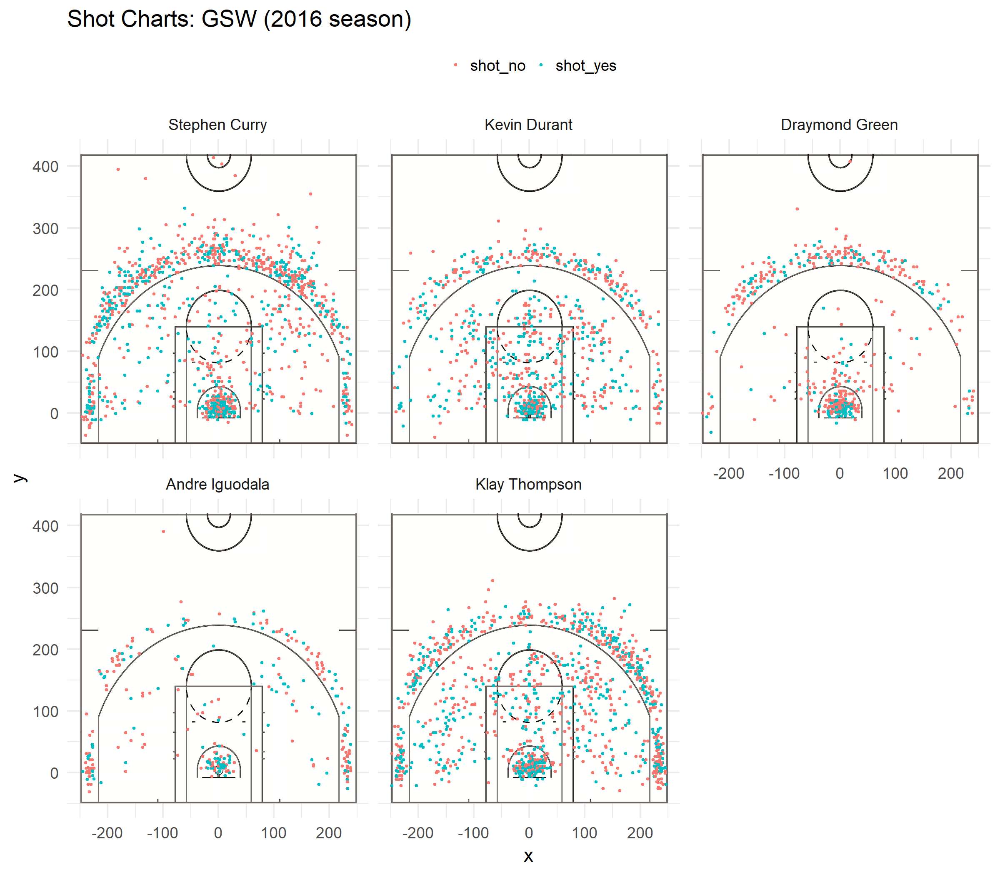

workout01-audrey-kim
================
Audrey Kim
March 12, 2019

    ## 
    ## Attaching package: 'dplyr'

    ## The following objects are masked from 'package:stats':
    ## 
    ##     filter, lag

    ## The following objects are masked from 'package:base':
    ## 
    ##     intersect, setdiff, setequal, union

Motivation
----------

In the 2016-2017 season, the Warriors made history. They had the longest winning streak in the postseason, and scored the most three-pointers in the NBA Finals quarter and half games. What is their secret to consistently being one of the best teams in the NBA? Basketball is simple; the more shots you score, the better your team.

It is no secret that the Warriors have some of the best players who can shoot. Recently, there was a claim made from SB Nation [SB Nation link](https://www.goldenstateofmind.com/2018/2/21/17010344/2018-nba-golden-state-warriors-steph-curry-efficiency-deep-threes-layups) that Steph Curry is just as effective shooting across 30 feet when shooting from 3 feet.



Is this true? Let us look at the best five ranked players from the 2016-17 season: Klay Thompson, Stephen Curry, Kevin Durant, Draymond Green, and Andre Iguodala. We will dissect just how effective these players are, and if they are just as effective shooting across different distances from the hoop: success percentages of 2-pointers, 3-pointers, and overall.

These approaches will be made from a statistical perspective, by using R, the official coding program for statisticians. The article will be divided into 7 parts: Motivation, Background, Data, Analysis, Discussion, Conclusion, and References. In the Data section, the article will include chunks of code where statistical calculations are made.

Background
----------

If you are unfamiliar with the Golden State Warriors, here's a bit of background on these top 5 players, also known as the "Hampton 5" lineup. First on the list, Kevin Durant was the NBA finals MVP and one of the league's best players the two seasons he was with the Golden State up til 2016. Iguodala is one of the oldest players on the team; despite this pullback, he still remains one of the best. Klay Thompson is a four-time All Star who is one of the best shooters ever in Golden State Warrior history. Stephen Curry, who truly gets to see the light in his later is, is one of the best shooters even in 2016. Last but not least, Draymond Green is known for his amazing defense on the team.

Data
----

Here, we can see a general overview of the overall effectiveness of the top 5 Warrior players:

#### Effective Shooting % by Player

``` r
effective_overall
```

    ## # A tibble: 5 x 4
    ##   `shots_data$name` total  made perc_made
    ##   <fct>             <int> <int>     <dbl>
    ## 1 Kevin Durant        915   495     0.541
    ## 2 Andre Iguodala      371   192     0.518
    ## 3 Klay Thompson      1220   575     0.471
    ## 4 Stephen Curry      1250   584     0.467
    ## 5 Draymond Green      578   245     0.424

The overall effectiveness includes shots made from 2-pointers as well as 3-pointers. As you can see, Kevin Durant is at the top of the list, with an impressive 54% success rate.

Andre Iguodala, who comes just after him with a 52% success rate, doesn't make as many shot attempts during games. In fact, he attempts just about a third of number of shots as Durant does -- while Durant attempts 915, Iguodala attempts 317. He is a sniper with incredible precision.

Stephen Curry and Klay Thompson show similar stats in the shots they attempt and make. Draymon Green is a rising sniper in the list; he doens't attempt too many shots, but makes a good amount of them (42%).

But just how many of these shots are from 2-pointers and 3-pointers?

#### 2 PT Effective Shooting % by Player

``` r
effective_2pt
```

    ## # A tibble: 5 x 4
    ##   `shots_data$name` total  made perc_made
    ##   <fct>             <int> <int>     <dbl>
    ## 1 Andre Iguodala      210   134     0.638
    ## 2 Kevin Durant        643   390     0.607
    ## 3 Stephen Curry       563   304     0.540
    ## 4 Klay Thompson       640   329     0.514
    ## 5 Draymond Green      346   171     0.494

#### 3 PT Effective Shooting % by Player

``` r
effective_3pt
```

    ## # A tibble: 5 x 4
    ##   `shots_data$name` total  made perc_made
    ##   <fct>             <int> <int>     <dbl>
    ## 1 Klay Thompson       580   246     0.424
    ## 2 Stephen Curry       687   280     0.408
    ## 3 Kevin Durant        272   105     0.386
    ## 4 Andre Iguodala      161    58     0.360
    ## 5 Draymond Green      232    74     0.319

### Analysis

First, let's take a look at **Klay Thompson.** Thompson's effectiveness is 51% when shooting from a 2-pointer. His effectiveness drops by 9% when shooting from a 3-pointer, to almost 42%. From a visual chart, we can see exactly from where he made his shots:



As expected from the top player on the list, many of his shots are from both from the 2-pointer and 3-pointer. The green dots show where he made his shots, and the red ones show where his attempts failed. Much of his shots from 3-pointers are concentrated from the right and left around the rim, and to the sides of the court. Some points are made through a straight path in the middle. Many of his 2-pointers are made right under the rim. We can also tell that he makes more shots from the right side of the field.

Next is **Stephen Curry.**  Curry's effectiveness becomes similarly affected by distance as Thompson's, if not more. His effectiveness from a 2-pointer is 54%, while from a 3-pointer drops 13%, to 41%. He makes the most shots out of all the players, and like Thompson, much of his 2-pointers are made right under the rim.

We can see that unlike Thompson, Curry has made less shots within the 3-point rim, and some shots near the midcourt line (he is more of a risktaker), though though those weren't successful. And visibly, he makes more effective shots from the left side of the court (both near the outer rim and the sideline) than the right.

The next player under the microscope is **Kevin Durant.**  As seen from the data chart, Kevin Durant's success rate when shooting from a 2-pointer is 61%. However, his success rate when shooting from a 3-pointer is 39%, which is a whamming 22% difference. In this visual graph, we can see right away that he makes more shot attempts within the 3-point circle, and not as much from the outer edge of it. The success rate nearly doubles when he moves closer to the rim, and Durant clearly knows his strengths.

**Draymond Green,** the weakest shooter out of the top 5, and visually we can see why. He doesn't attempt as much shots, and his not so effective attempts are more visible than others.  Green success rate from a 2-pointer is 49%. For Green, the difference is a bit more than the other players -- from a 3 pointer, his effectiveness drops to 32%. A 17% difference says something huge. We can see that most of his shots are attempted from all around the 3-point line (excluding sidelines), and almost all shots from within the circle are below the basket.

The last player on our list, **Andre Iguodala,** has the highest effectiveness shooting from a 2-pointer: 64%. However, like Durant, this drops significantly when shooting from a 3-pointer, to 36%. That is a whopping 28% difference, which is even greater than Durant.  Right away, we can see that Igudala attempts the least amount of shots from the top 5, and almost none of his attempts are from the middle across the third point line. Like other players, thre is a concentration of shots from under the basket. What is interesting about Durant and Iguodala is that overall, they are the top 2 players from the team; however, they are both significantly affected by the distance they are shooting from -- in fact, their percentage of effectiveness is the greatest depending on their distance.

Let's dig into the the analysis in deeper detail. Shown from the data tables from the Data section, each player shows different success percentages depending on if they are shooting from a 2-pointer or a 3-pointer. In fact, Andre Iguodala, the "sniper," has the greatest difference of success depending on his distance.

Taking the average difference of success between 2-pointers and 3-pointers of all the players, we find out that the top players are 17.8% more likely to succeed shooting close-range than shooting far-range. Not coincidentally, the players who are more effective in shooting from 2-pointers (Iguodala 64%, Durant 61%) are the most effective in the overall scores than the players who are more effective in shooting from 3-pointers (Thompson 42%, Curry 41%).

### Discussion

Taking the data from the 5 players, we clearly saw that distance has a huge effect on the effectiveness of their shots.  Each player has their strengths and weakensses; some players are more effective shooting from left or right sides or the field; some make more attempts, and some less. But collectively, all the players made more shots closer up to the rim than from further away (the 30-feet and 3-feet effectiveness may have been an exaggeration). Contrary to popular belief, what makes a player strong is their ability to score shots from far lengths isnot their strength; what makes a player valuable to the team is how effective they are from shooting close ranges.

### Conclusion

Overall, this exploration showed that it does not matter whether a player can make more shots from further away; rather, what matters is who makes the most shots, close or far. Moreover, it shows that the players who are able to shoot most from a 2-pointer (with a great gap between their score from a 3-pointer) will be more valuable to the team. Stronger players will have a great gap between their success rates from their 2-pointer shots and 3-pointer shots.

### The Takeaway (Summary)

Top GWS players have great disparity between their 2-point and 3-point shoot success rates; however, their rate of success shooting from 2-pointers is what makes them the greatest in their team.

### References

Warriors Players Background Information: <https://www.nba.com/gamenotes/warriors.pdf> <https://www.goldenstateofmind.com/2018/2/21/17010344/2018-nba-golden-state-warriors-steph-curry-efficiency-deep-threes-layups>

Stephen Curry Picture: <https://bleacherreport.com/articles/2785891-ranking-the-top-10-players-in-golden-state-warriors-history#slide10>
